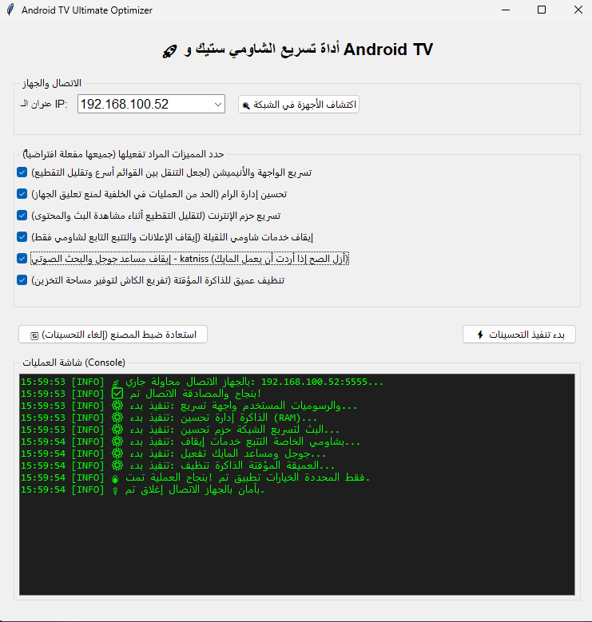

# 🚀 Android TV Ultimate Optimizer (GUI Edition)


🌍 **Choose your language / اختر لغتك:**
* [🇬🇧 English Version](#-english-version)
* [🇸🇦 النسخة العربية](#-النسخة-العربية)

---

<div align="center">
  
</div>

---

## 🇬🇧 English Version

### 📌 Overview
An advanced, user-friendly desktop application with a graphical interface (GUI) designed to drastically improve the performance of low-end Android TV devices (e.g., Xiaomi TV Stick, Mi Box, Chromecast). Built with Python and Tkinter, this tool connects to your TV over Wi-Fi via ADB and injects deep OS-level tweaks to maximize hardware efficiency, manage RAM aggressively, and eliminate UI lag—all with a single click.

### ✨ Key Features
* **Intuitive GUI:** A clean, multithreaded Windows interface with a real-time output console.
* **Auto RSA Key Generation:** The app automatically generates ADB authentication keys if they are missing. No manual scripting required!
* **Zero UI Lag:** Natively disables all window animations to ensure instantaneous remote response.
* **Hardware Acceleration (GPU):** Forces the OS to utilize the GPU for UI rendering, offloading the CPU for heavy streaming tasks.
* **Aggressive RAM Management:** Limits background processes to exactly **1 process** and tunes the Dalvik VM heap size specifically for 1GB/2GB RAM environments.
* **Network Streaming Buffer Boost:** Expands TCP buffer sizes in the Kernel to prevent buffering during high-bitrate streaming (IPTV, 4K content).
* **Bloatware & Telemetry Killer:** Safely disables resource-heavy tracking services and the Google Voice Search engine (`Katniss`), freeing up to 150MB+ of RAM.
* **Deep Cache Trimming:** Clears accumulated cache from the eMMC storage.

### 🛠️ Prerequisites
1. Enable ADB on your TV:
   * `Settings` > `Device Preferences` > `About`.
   * Click on `Build` 7 times to unlock **Developer Options**.
   * Go back, open `Developer Options`, and enable **USB Debugging** (and **Wireless Debugging** if available).
2. Find your TV's IP Address (`Settings` > `Network & Internet`).

### 🚀 Installation & Usage

1. Clone the repository:
   ```bash
   git clone [https://github.com/Turki-Alshaikh/Tv-Optimizer-Android.git](https://github.com/Turki-Alshaikh/Tv-Optimizer-Android.git)
   cd Tv-Optimizer-Android

   Install the required Python libraries:Bashpip install adb-shell cryptography
Run the application:Bashpython tv_app.py
Enter your TV's IP address in the text field and click Optimize.Crucial Step: Immediately look at your TV screen. You will see an "Allow USB Debugging?" prompt. Check the "Always allow from this computer" box and click OK.📦 Building a Standalone Windows App (.exe)If you want to share this tool as a simple executable file without requiring Python installation:Bashpip install pyinstaller
pyinstaller --noconsole --onefile tv_app.py
Your standalone .exe file will be generated in the dist folder.🧠 The Boring Technical Details (Under the Hood)For the developers and geeks, here is exactly what the script injects into the Android Shell:Target CategoryInjected CommandTechnical PurposeUI Speedsettings put global window_animation_scale 0Bypasses window rendering times, making menu navigation instantaneous. Saves CPU cycles.GPU Renderingsetprop persist.sys.ui.hw 1Forces Hardware Acceleration for the UI. Shifts rendering load from the weak CPU to the GPU.RAM Tuningsetprop dalvik.vm.heapsize 128mLimits the JVM maximum memory allocation per app, preventing out-of-memory crashes.Background Limitssettings put global activity_manager_max_running_operations 1Kills suspended apps aggressively to dedicate 100% of the RAM to the foreground streaming app.Network Bufferssetprop net.tcp.buffersize.wifi ...Modifies the Kernel's TCP window sizes to allow larger packets, directly reducing network stuttering.Bloatwarepm disable-user com.google.android.katnissDisables Google Voice Search. Frees ~150MB of RAM but disables the remote's mic button.🇸🇦 النسخة العربية📌 نظرة عامةتطبيق سطح مكتب متقدم وسهل الاستخدام بواجهة رسومية (GUI) مصمم لتحسين أداء الأجهزة الضعيفة التي تعمل بنظام Android TV بشكل جذري (مثل شاومي ستيك، مي بوكس، وكروم كاست). تم بناء الأداة باستخدام لغة بايثون ومكتبة Tkinter، وتقوم بالاتصال بجهاز التلفاز عبر الواي فاي (ADB) لحقن تعديلات عميقة في نظام التشغيل لزيادة كفاءة العتاد وإدارة الرام بشراسة بضغطة زر واحدة.✨ المميزات الرئيسيةواجهة رسومية بسيطة: واجهة تعمل بنظام المسارات المتعددة (Multithreaded) مع شاشة لعرض العمليات الحية.توليد تلقائي للمفاتيح: يقوم التطبيق بإنشاء مفاتيح المصادقة (RSA) تلقائياً إذا لم تكن موجودة، دون الحاجة لأي تدخل برمجي.استجابة فورية للواجهة: تعطيل كافة التأثيرات الحركية من جذور النظام لضمان استجابة فورية للريموت.تسريع العتاد (GPU): إجبار النظام على استخدام معالج الرسوميات لعرض الواجهة، مما يفرغ المعالج الرئيسي لمهام تشغيل الفيديو.إدارة صارمة للرام: تحديد العمليات في الخلفية لتكون عملية واحدة فقط، وتعديل حجم الذاكرة (Dalvik VM) ليتناسب مع الأجهزة ذات 1GB رام.توسيع نوافذ الشبكة: تعديل قيم شبكة TCP في الكيرنل لتسريع نقل البيانات ومنع التقطيع أثناء البث المباشر.إزالة تطبيقات النظام: إيقاف محرك بحث جوجل الصوتي (Katniss) وخدمات التتبع، مما يحرر أكثر من 150 ميجابايت من الرام.🛠️ المتطلبات الأساسيةتفعيل وضع المطور في التلفاز:اذهب إلى الإعدادات > تفضيلات الجهاز > لمحة.اضغط على رقم الإصدار (Build) 7 مرات حتى يظهر الإشعار.ارجع للخلف، وادخل إلى خيارات المطور، وقم بتفعيل تصحيح أخطاء USB (USB Debugging).معرفة الـ IP الخاص بالتلفاز من خلال إعدادات الشبكة.🚀 التثبيت وطريقة الاستخدامقم باستنساخ المستودع:Bashgit clone [https://github.com/Turki-Alshaikh/Tv-Optimizer-Android.git](https://github.com/Turki-Alshaikh/Tv-Optimizer-Android.git)
cd Tv-Optimizer-Android
قم بتثبيت المكتبات المطلوبة:Bashpip install adb-shell cryptography
قم بتشغيل التطبيق:Bashpython tv_app.py
أدخل عنوان الـ IP الخاص بالتلفاز واضغط على بدء التحسين.خطوة حاسمة: انظر إلى شاشة التلفاز فوراً. ستظهر رسالة "السماح بتصحيح أخطاء USB؟". حدد خيار "السماح دائماً من هذا الكمبيوتر" واضغط موافق.📦 تحويل الكود إلى برنامج ويندوز تنفيذي (.exe)إذا أردت مشاركة هذه الأداة كبرنامج جاهز يعمل بضغطة زر بدون الحاجة لتثبيت بايثون:Bashpip install pyinstaller
pyinstaller --noconsole --onefile tv_app.py
سيتم استخراج ملف الـ .exe المستقل الخاص بك داخل مجلد dist.🧠 التفاصيل التقنية المملة (ما تحت الغطاء)للمهندسين والمطورين، إليك تفصيل دقيق لما يقوم التطبيق بحقنه في نواة الأندرويد:الفئةالأمر البرمجيالوظيفة التقنيةسرعة الواجهةwindow_animation_scale 0يلغي وقت تصيير النوافذ، مما يجعل التنقل بين القوائم لحظياً ويوفر دورات المعالجة.الرسومياتsetprop persist.sys.ui.hw 1يجبر النظام على استخدام تسريع العتاد لتتولى وحدة الـ GPU رسم الواجهة.إدارة الرامdalvik.vm.heapsize 128mيحد من استهلاك الآلة الافتراضية للذاكرة لكل تطبيق، مما يمنع انهيار النظام.الخلفيةactivity_manager_max_running_operations 1يقتل التطبيقات المعلقة بشراسة لتوجيه 100% من الرام للتطبيق الحالي.نطاق الشبكةnet.tcp.buffersize.wifi ...يعدل أحجام نوافذ TCP للسماح بحزم بيانات أكبر، مما يقلل التقطيع أثناء البث.إزالة العبءpm disable-user com.google.android.katnissيعطل البحث الصوتي، مما يوفر حوالي 150MB رام، ولكنه يعطل زر الميكروفون.📝 License / الترخيص: This project is open-source and available under the MIT License.
