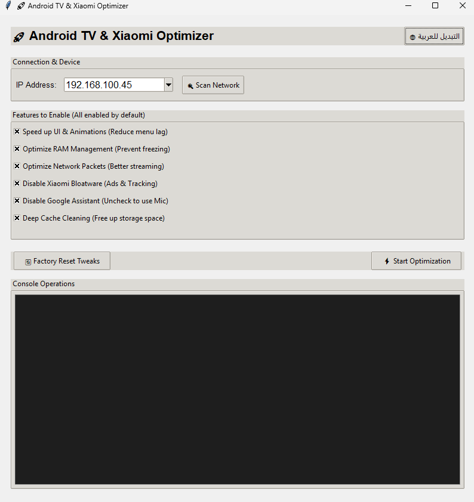
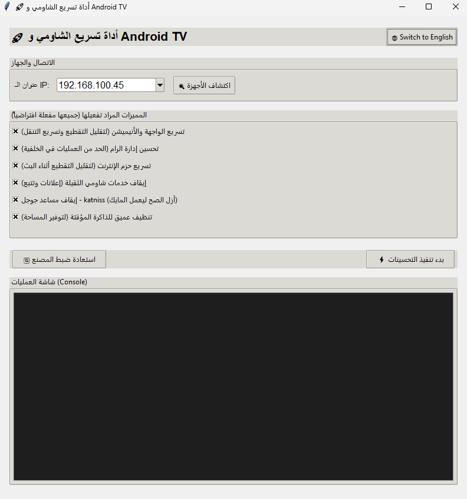

# 🚀 Android TV & Xiaomi Ultimate Optimizer (GUI Edition)


[**English 🇬🇧**](#-english-version) | [**العربية 🇸🇦**](#-النسخة-العربية)

---

<div align="center">
  <h3>🌍 Bilingual UI / واجهة ثنائية اللغة</h3>
  
  
</div>

---

## 🇬🇧 English Version

### 📌 Overview
An advanced, user-friendly desktop application with a Graphical User Interface (GUI) designed to radically optimize the performance of low-end Android TV devices (such as Xiaomi TV Stick, Mi Box, and Chromecast). Built with Python and Tkinter, it connects to your TV over Wi-Fi (via ADB) to inject deep OS modifications, boosting hardware efficiency and aggressively managing RAM for a lag-free experience.

### ✨ Key Features
* **Bilingual UI (New):** Instantly switch between English and Arabic with a single click without restarting the app.
* **Intelligent Error Handling (New):** Safely and silently skips missing packages (like the absence of Google Play Services or specific Xiaomi bloatware on modified OS versions) without causing errors or crashes.
* **Smart Network Scan:** Auto-detects Android TV devices on your local network (Port 5555) for seamless connection.
* **Full Customization:** Toggle individual tweaks via checkboxes so you only apply what you need.
* **Factory Reset:** A dedicated button to safely revert all changes and restore your device to its stock settings.
* **Auto RSA Generation:** Automatically generates ADB authentication keys if they do not exist on your machine.
* **Instant UI Response:** Disables all animations at the system level for zero input lag when navigating menus.
* **GPU Hardware Acceleration:** Forces the GPU to render the UI, freeing up the main CPU for streaming tasks.
* **Aggressive RAM Management:** Limits background processes to 1 and tweaks Dalvik VM heap sizes, preventing system freezes.
* **Network Buffers Expansion:** Tweaks kernel TCP network values to speed up data transfer and prevent buffering during live streams.
* **Mic & Voice Search Control:** Toggle Google Assistant (`Katniss`) on or off. Disable it to free up ~150MB of RAM, or keep it on if you use voice commands.

### 🛠️ Prerequisites
1. **Enable Developer Mode on your TV:**
   * Go to `Settings` > `Device Preferences` > `About`.
   * Click on `Build` 7 times until the "You are now a developer" toast notification appears.
   * Go back, open `Developer Options`, and enable **USB Debugging**.
2. Ensure both your TV and PC are connected to the **same Wi-Fi network**.

### 🚀 Installation & Usage
1. **Clone the repository:**
   ```bash
   git clone [https://github.com/Turki-Alshaikh/Tv-Optimizer-Android.git](https://github.com/Turki-Alshaikh/Tv-Optimizer-Android.git)
   cd Tv-Optimizer-Android

```

2. **Install required libraries:**
```bash
pip install adb-shell cryptography

```


3. **Run the application:**
```bash
python tv_optimizer.py

```


4. **Crucial Step:** Immediately look at your TV screen. A prompt will appear asking "Allow USB debugging?". Check the box that says **"Always allow from this computer"** and press **OK**.

### 🧠 Under the Hood (Technical Details)

For engineers and developers, here is exactly what the app injects into the Android kernel:

| Category | Command Injected | Technical Function |
| --- | --- | --- |
| **UI Speed** | `window_animation_scale 0` | Eliminates window rendering time, making menu navigation instant. |
| **Graphics** | `setprop persist.sys.ui.hw 1` | Forces hardware acceleration; hands UI rendering over to the GPU. |
| **RAM Setup** | `dalvik.vm.heapsize 128m` | Limits Virtual Machine memory consumption per app to prevent crashing. |
| **Background** | `activity_manager_max_running_operations 1` | Kills suspended apps, dedicating 100% of RAM to the active app. |
| **Network** | `net.tcp.buffersize.wifi ...` | Adjusts TCP window sizes to allow larger data packets, reducing stream lag. |
| **Assistant** | `pm disable-user com.google.android.katniss` | Disables voice search to free up massive RAM space (can be re-enabled). |

### 📺 Supported By | Mfatihy Store

Just as this tool optimizes your Android TV for maximum performance, you can secure and optimize your PC's performance with genuine software from **[Mfatihy Store](https://mfatihy.com)**. Say goodbye to malware from cracked software and upgrade to authentic **[Windows 11/10 Pro keys](https://mfatihy.com/windows-keys/c1242520213)** and reliable **[Security & Antivirus subscriptions](https://mfatihy.com/security/c2023318291)** at unbeatable prices.

---

---

## 🇸🇦 النسخة العربية

### 📌 نظرة عامة

تطبيق سطح مكتب متقدم وسهل الاستخدام بواجهة رسومية (GUI) مصمم لتحسين أداء الأجهزة الضعيفة التي تعمل بنظام Android TV بشكل جذري (مثل شاومي ستيك، مي بوكس، وكروم كاست). تم بناء الأداة باستخدام لغة بايثون ومكتبة Tkinter، وتقوم بالاتصال بجهاز التلفاز عبر الواي فاي (ADB) لحقن تعديلات عميقة في نظام التشغيل لزيادة كفاءة العتاد وإدارة الرام بشراسة.

### ✨ المميزات الرئيسية

* **واجهة ثنائية اللغة (جديد):** التبديل الفوري بين اللغتين العربية والإنجليزية بضغطة زر دون الحاجة لإعادة تشغيل البرنامج.
* **التعامل الذكي مع الأخطاء (جديد):** تخطي آمن بصمت للحزم غير الموجودة (مثل غياب خدمات جوجل بلاي أو حزم شاومي في بعض الأنظمة المخصصة) دون توقف الأداة أو ظهور أخطاء.
* **فحص ذكي للشبكة:** اكتشاف تلقائي لأجهزة Android TV المتصلة بالشبكة المحلية لسهولة الاتصال.
* **تخصيص كامل:** التحكم في كل خيار تحسين عبر صناديق اختيار (Checkboxes) لتفعيل ما تحتاجه فقط.
* **استعادة ضبط المصنع:** زر مخصص للتراجع عن كافة التحسينات وإعادة الجهاز لحالته الأصلية بأمان.
* **توليد تلقائي للمفاتيح:** يقوم التطبيق بإنشاء مفاتيح المصادقة (RSA) تلقائياً إذا لم تكن موجودة.
* **استجابة فورية للواجهة:** تعطيل كافة التأثيرات الحركية من جذور النظام لضمان استجابة فورية للريموت.
* **تسريع العتاد (GPU):** إجبار النظام على استخدام معالج الرسوميات لعرض الواجهة، مما يفرغ المعالج الرئيسي لمهام البث.
* **إدارة صارمة للرام:** تحديد العمليات في الخلفية لتكون عملية واحدة فقط، وتعديل حجم الذاكرة (Dalvik VM) للأجهزة الضعيفة.
* **توسيع نوافذ الشبكة:** تعديل قيم شبكة TCP في الكيرنل لتسريع نقل البيانات ومنع التقطيع أثناء البث المباشر.
* **التحكم بالمايك والبحث الصوتي:** خيار مخصص لإيقاف أو تشغيل مساعد جوجل (`Katniss`) للحفاظ على عمل المايك أو تحرير 150 ميجابايت من الرام.

### 🛠️ المتطلبات الأساسية

1. **تفعيل وضع المطور في التلفاز:**
* اذهب إلى `الإعدادات` > `تفضيلات الجهاز` > `لمحة`.
* اضغط على `رقم الإصدار (Build)` 7 مرات حتى يظهر الإشعار.
* ارجع للخلف، وادخل إلى `خيارات المطور`، وقم بتفعيل **تصحيح أخطاء USB (USB Debugging)**.


2. تأكد أن التلفاز والكمبيوتر متصلان بنفس **شبكة الواي فاي**.

### 🚀 التثبيت وطريقة الاستخدام

1. **استنسخ المستودع:**
```bash
git clone [https://github.com/Turki-Alshaikh/Tv-Optimizer-Android.git](https://github.com/Turki-Alshaikh/Tv-Optimizer-Android.git)
cd Tv-Optimizer-Android

```


2. **ثبت المكتبات المطلوبة:**
```bash
pip install adb-shell cryptography

```


3. **قم بتشغيل التطبيق:**
```bash
python tv_optimizer.py

```


4. **خطوة حاسمة:** انظر إلى شاشة التلفاز فوراً. ستظهر رسالة "السماح بتصحيح أخطاء USB؟". حدد خيار **"السماح دائماً من هذا الكمبيوتر"** واضغط **موافق**.

### 🧠 التفاصيل التقنية المملة (ما تحت الغطاء)

للمهندسين والمطورين، إليك تفصيل دقيق لما يقوم التطبيق بحقنه في نواة الأندرويد:

| الفئة | الأمر البرمجي | الوظيفة التقنية |
| --- | --- | --- |
| **سرعة الواجهة** | `window_animation_scale 0` | يلغي وقت تصيير النوافذ، مما يجعل التنقل بين القوائم لحظياً. |
| **الرسوميات** | `setprop persist.sys.ui.hw 1` | يجبر النظام على استخدام تسريع العتاد لتتولى وحدة الـ GPU رسم الواجهة. |
| **إدارة الرام** | `dalvik.vm.heapsize 128m` | يحد من استهلاك الآلة الافتراضية للذاكرة لكل تطبيق لمنع التعليق. |
| **الخلفية** | `activity_manager_max_running_operations 1` | يقتل التطبيقات المعلقة لتوجيه 100% من الرام للتطبيق المفتوح حالياً. |
| **نطاق الشبكة** | `net.tcp.buffersize.wifi ...` | يعدل أحجام نوافذ TCP للسماح بحزم بيانات أكبر لتقليل التقطيع. |
| **المايك والمساعد** | `pm disable-user com.google.android.katniss` | يعطل البحث الصوتي لتوفير مساحة رام ضخمة (يمكن إعادة تفعيله من الأداة). |

### 📺 Supported By | بدعم من متجر مفاتيحي

كما تساعدك هذه الأداة في تنظيف وتحسين أداء شاشات وأنظمة الأندرويد، يمكنك أيضاً حماية جهازك الشخصي والارتقاء بأدائه عبر استخدام برامج أصلية من **[متجر مفاتيحي (Mfatihy)](https://mfatihy.com)**.

تجنب مشاكل وبطء النظام الناتجة عن الكراكات، واحصل على **[مفاتيح تفعيل ويندوز أصلية](https://mfatihy.com/windows-keys/c1242520213)** وحزم **[مايكروسوفت أوفيس](https://mfatihy.com/Office/c2015509396)** بأسعار تنافسية جداً. نحن نلتزم بتوفير تراخيص آمنة وموثوقة مع سياسة دعم واضحة لعملائنا في السعودية والخليج.
 
---

## 📄 License / الترخيص

This project is licensed under the [MIT License](https://www.google.com/search?q=LICENSE).
هذا المشروع مرخص تحت رخصة MIT.

## ⚠️ Disclaimer / إخلاء المسؤولية

This tool makes system-level modifications. Use at your own risk. Ensure you understand the changes before applying them.
هذه الأداة تقوم بتعديلات على مستوى النظام. استخدمها على مسؤوليتك الخاصة. تأكد من عمل نسخة احتياطية من إعدادات جهازك قبل التطبيق.

```

```